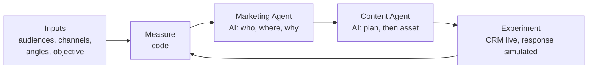

# SignalLoop

**A product marketing prototype built around one question: given campaign evidence, which audience, channel and message should a marketer test next, and why?** Deterministic code measures how audiences, channels and messages perform; a **Marketing Agent** recommends the next experiment and cites its evidence; a **Content Agent** turns the approved recommendation into the asset to test. A marketer approves each step, and every experiment runs against the best version so far.

### 👉 [View the case study and live demo](https://signalloop-shiva.netlify.app)

A product marketing portfolio project by **Shiva Goel**.

- **Role:** product strategy, PMM workflow design, experimentation logic, AI system design, implementation (AI-assisted), case study
- **Status:** working prototype with simulated campaign data, seeking feedback from product marketers


---

## The problem I wanted to investigate

Generative AI lowers the cost of producing another email, post or landing page. My hypothesis is that this moves the hard part of product marketing upstream: **deciding which audience, channel and message deserve the next experiment, and why.** SignalLoop asks AI to help make that call from measured evidence, while the marketer keeps the final decision.

This is a hypothesis, not a validated finding. The next step is testing it with product marketers: whether the problem is painful enough, whether these are the inputs and trade-offs PMMs use, what evidence they would need to trust a recommendation, and where it would fit in a real workflow.

**Scenarios.** Ramp and Square are illustrative. Their audience segments (role-based for Ramp, business-stage for Square) are my assumptions for the demonstration, not either company's segmentation, and no internal data or research informed them.

## How it works



1. **Inputs.** Each company profile defines audiences, their channels, messaging angles, content types, brand rules and constraints. The marketer sets the campaign objective (awareness, traffic, engagement, product consideration, or conversion).
2. **Measure (code).** The analytics engine calculates reach, clicks, CTR, pooled history by audience, channel, angle and content type, the change since the previous experiment, the efficiency leader (highest CTR) and volume leader (most clicks), and whether a difference is too small to call (two-proportion z-test plus a minimum click count). Every metric has an id.
3. **Marketing Agent (AI).** When the marketer asks for a recommendation, it reads only the metrics it needs through read-only tools and decides the priority audience, channel, messaging angle, content type and hypothesis, weighing efficiency against volume for the objective. It must cite metric ids it actually retrieved; code rejects anything else.
4. **Content Agent (AI).** Once the marketer has reviewed the recommendation, it turns that decision into a content plan (insight, angle, topic, hook, headline, key message, CTA, format, brief) and then the asset, returned in parts (subject or title, preview text, paragraphs, button text) so the demo can preview it as a real email, post or article. It can't change the Marketing Agent's choices and can't repeat earlier topics.
5. **Experiment.** The new variant runs against a control (the best variant so far for that audience and channel). HubSpot contacts and lists are updated for real; audience response is simulated. Results return to step 2.

## Why analytics are calculated in code

Language models are unreliable at arithmetic, can't be audited, and can "find" patterns that aren't in the data. Keeping all math in deterministic code means every number is reproducible, and every agent recommendation can be traced to the exact metrics it cited.

## What is real, simulated or AI

| Component | Status |
|---|---|
| HubSpot CRM (fictional sample contacts, `persona` property, audience lists) | **LIVE** when `HUBSPOT_MODE=live` and `HUBSPOT_ACCESS_TOKEN` are set; mock otherwise |
| Campaign delivery | **SIMULATED**: no emails or posts are sent |
| Performance data (reach, clicks) | **SIMULATED** by `lib/sim-truth.mjs`, which the agents never see |
| Analytics | **CODE**: deterministic |
| Marketing recommendation, content plan and asset | **AI** (Groq, with Gemini as fallback) |
| Experiment history | **STORED** per visitor session in Upstash Redis (expires after 30 days without use) |

No performance number in this project comes from a real campaign.

## What this demonstrates

- **Audience intelligence:** how each segment responds, and how confident we can be
- **Channel intelligence:** efficiency versus volume, weighed against the campaign objective
- **Messaging strategy:** which angles and content types work for which audience
- **Content planning:** strategy before copy, grounded in what has been tested
- **Experimentation:** test versus control, with results that change the next decision
- **AI system design with clear boundaries:** code calculates, agents decide and create, and recommendations are traceable

## What production would need

- **Real performance data:** email engagement from HubSpot Marketing Hub, social data, and site analytics, with attribution to pipeline
- **Real delivery with human approval:** review for brand, legal and product claims
- **Stronger experiment design:** sample sizes and durations set in advance, and more than two variants per test
- **Agent quality and oversight:** an evaluation set, logging of every tool call and output, and stricter claim checks
- **Scale and governance:** paid model tiers, cost budgets, consent and privacy controls for real contacts
- **Business outcomes:** optimize for pipeline and revenue, not only clicks

---

## Repository structure

```text
signalloop/
├── docs/                      # Case study page and live demo (static, served by Vercel)
│   ├── index.html
│   ├── demo.js
│   └── img/
├── api/                       # Vercel Functions: session, run, strategy, content, reset
├── lib/
│   ├── api.mjs                # Shared API handler: validation, rate limit, daily caps
│   ├── analytics.mjs          # Deterministic analytics engine
│   ├── simulator.mjs          # Simulated audience response
│   ├── sim-truth.mjs          # Hidden simulation model (never shown to agents)
│   ├── loop.mjs               # Experiment loop: distribute, measure, recommend, create
│   ├── hubspot.mjs            # HubSpot CRM client (live or mock)
│   ├── llm.mjs                # Groq and Gemini adapter with fallback
│   ├── store.mjs              # Upstash Redis storage (in memory locally)
│   └── agents/                # Marketing Agent, Content Agent, their tools and validation
├── data/
│   ├── companies/             # Ramp and Square profiles, plus _template.json
│   └── contacts.json          # 20 fictional sample contacts (@example.com)
├── scripts/                   # Local preview server, provider check, terminal loop
├── test/                      # node:test suite
├── assets/preview-flow.png    # Architecture diagram
├── vercel.json
└── package.json
```

## Configuration (Vercel environment variables)

| Variable | Purpose |
|---|---|
| `GROQ_API_KEY` | Primary AI provider (mark as Sensitive) |
| `GEMINI_API_KEY` | Fallback AI provider when Groq fails or is rate limited (Sensitive) |
| `GROQ_MODEL`, `GEMINI_MODEL` | Optional model overrides (defaults `openai/gpt-oss-120b`, `gemini-3.1-flash-lite`) |
| `HUBSPOT_ACCESS_TOKEN` | HubSpot service key (Sensitive) with scopes `crm.objects.contacts.read`, `crm.objects.contacts.write`, `crm.lists.read`, `crm.lists.write`, `crm.schemas.contacts.read`, `crm.schemas.contacts.write` |
| `HUBSPOT_MODE` | `live` to write to HubSpot; anything else uses mock mode |
| `KV_REST_API_URL`, `KV_REST_API_TOKEN` | Upstash Redis for experiment history and usage limits. Added automatically when Upstash Redis is connected from the Vercel Marketplace; `UPSTASH_REDIS_REST_URL` and `UPSTASH_REDIS_REST_TOKEN` also work |

Without an AI key, the demo still runs baselines and analytics, and clearly reports that the agents are not connected. On Vercel the API needs Upstash Redis; locally, without it, history is kept in memory.

## Deploy on Vercel

1. Import this GitHub repository as a new Vercel project (Framework Preset: Other). `vercel.json` serves `docs/` and deploys the functions in `api/`.
2. In the project's Storage tab, add **Upstash Redis** from the Marketplace and connect it to the project.
3. Add the environment variables above, then redeploy.

## Run locally (Node 22.9+)

1. Install dependencies and create your local environment file. `.env` is ignored by git; never commit it.

   ```bash
   npm install
   cp .env.example .env
   ```

2. Open `.env` and add `GROQ_API_KEY` and/or `GEMINI_API_KEY`. Keep `HUBSPOT_MODE=mock` locally unless you want test runs to write to HubSpot.

3. Check that the providers support what the agents need (a reply, tool calling and JSON-schema output):

   ```bash
   npm run check:ai
   ```

4. Run one real loop in the terminal (baseline, then Marketing Agent and Content Agent):

   ```bash
   npm run try:loop
   ```

   Optionally pass a company and objective, for example `npm run try:loop -- square traffic`.

5. Preview the site and live demo at `http://localhost:8888/#live`:

   ```bash
   npm run dev
   ```

Run the automated tests (no keys needed) with `npm test`.

---

## License

© 2026 Shiva Goel. All rights reserved. This repository is shared for portfolio review only; no part of it may be copied, modified, or reused without written permission. See [LICENSE](LICENSE).
