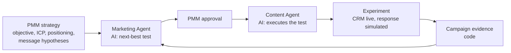

# SignalLoop

**A product marketing prototype built around one question: given the PMM strategy and the campaign evidence, which audience, channel and message should a marketer test next, and why?** Deterministic code measures results on the signal each campaign objective needs; a **Marketing Agent** combines those facts with the strategy (ICP, buying roles, positioning, message hypotheses) to recommend the next experiment and name what it should teach; a **Content Agent** executes the approved test. A marketer approves each step.

**Code measures. AI interprets. PMM approves. AI executes.**

### 👉 [View the case study and live demo](https://signalloop-dun.vercel.app)

A product marketing portfolio project by **Shiva Goel**.

- **Role:** PMM workflow and decision design, experiment framework, AI system design, implementation (AI-assisted), case study
- **Status:** working prototype. Campaign response is simulated, strategy inputs are working hypotheses, and the idea has not yet been validated with PMM interviews

---

## The problem I wanted to investigate

Generative AI lowers the cost of producing another email, post or landing page. My hypothesis is that this moves the hard part of product marketing upstream: **deciding which audience, channel and message deserve the next experiment, and why.** Campaign dashboards show what happened; they rarely say what was learned, which assumption changed, or which uncertainty matters most.

This is a hypothesis, not a validated finding. See [What I still need to validate](#what-i-still-need-to-validate).

**Scenarios.** Ramp and Square are illustrative. Their segments, ICP, positioning and message hypotheses are working hypotheses based on public product information, not either company's internal segmentation, research or strategy.

## How it works



1. **Strategy (PMM).** Each company profile in `data/companies/` defines audiences with their buying role, ICP fit and job to be done, plus the ICP, positioning, value proposition, product proof, competitive alternative, message hypotheses and constraints.
2. **Measure (code).** Each objective is judged on its own signal: awareness on qualified reach, engagement on engagement rate, traffic on CTR, product consideration on high-intent visits (product or proof pages), conversion on demo requests and sign-ups. The analytics engine pools results, finds efficiency and volume leaders, compares test against control, applies the evidence guardrail and a significance test, and states up to three learnings and three knowledge gaps. Every metric has an id.
3. **Interpret (Marketing Agent, AI).** Reads the strategy and the results through read-only tools, then returns the next test with what has been learned, the knowledge gap it reduces, why it beats the alternatives, the trade-off, confidence and its reason, and how the result will be read. It must cite at least one strategy input, at least one metric, and the last experiment's result; code rejects anything else. The same evidence can be re-run under another objective to compare recommendations.
4. **Approve (PMM).** Nothing is written or run until the marketer approves the recommendation, and then the content.
5. **Execute (Content Agent, AI).** Plans and writes the asset for the approved test, returned in parts so the demo can preview it as a real email, post or article. It can't change the audience, channel, message or format, and can't use numbers, names or links.
6. **Experiment.** The new variant runs against the current control, changing only the message or only the format so the result can be attributed. HubSpot contacts and lists are updated for real; the response is simulated. Results return to step 2, and the next recommendation has to build on them.

## Why analytics are calculated in code

Language models are unreliable at arithmetic, can't be audited, and can "find" patterns that aren't in the data. Keeping all math in deterministic code means every number is reproducible, and every recommendation can be traced to the exact metrics and strategy inputs it cited. AI does not replace PMM judgment; it compresses the analysis between evidence and the next decision.

## Evidence and statistics

- Each objective is judged on one primary signal, as a rate of the people reached.
- **Prototype evidence guardrail:** at least 30 qualified views or engagements, 20 clicks, 15 high-intent visits or 10 conversions per variant before a difference is judged.
- A difference is called only if it also passes a two-proportion z-test at about 95% confidence (|z| ≥ 1.96). Otherwise the result is "no clear difference" or "not enough evidence", and the observed gap is still reported.
- The guardrail is a fixed floor, not a power calculation. A production system would size each test in advance from the baseline rate, the minimum detectable effect, the significance level and statistical power.

## What is real, simulated or AI

| Component | Status |
|---|---|
| HubSpot CRM (fictional sample contacts, `persona` property, audience lists) | **LIVE** when `HUBSPOT_MODE=live` and `HUBSPOT_ACCESS_TOKEN` are set; mock otherwise |
| Strategy inputs (ICP, buying roles, positioning, message hypotheses) | **PMM CONTEXT**: working hypotheses based on public product information |
| Campaign delivery | **SIMULATED**: no emails or posts are sent |
| Response signals (reach, engagement, clicks, high-intent visits, conversions) | **SIMULATED** by `lib/sim-truth.mjs`, which the agents never see |
| Analytics, evidence guardrail and significance | **CODE**: deterministic |
| Marketing recommendation, content plan and asset | **AI** (Groq, with Gemini as fallback) |
| Experiment history | **STORED** per visitor session in Upstash Redis (expires after 30 days without use) |

No performance number in this project comes from a real campaign.

## What this demonstrates

- **PMM judgment in the loop:** ICP fit, buying roles, positioning and message hypotheses shape the recommendation, not just the metrics
- **Objective-specific success:** the same evidence can justify a different test when the objective changes
- **Experimentation discipline:** one variable per test, an explicit evidence guardrail, and "not enough evidence" when that is the truth
- **A real learning loop:** every recommendation names its knowledge gap and must build on the last result
- **AI system design with clear boundaries:** code measures, AI interprets and executes, a PMM approves; AI does not own positioning, ICP selection, proof claims or declaring winners

## What I still need to validate

No PMM interviews are reported here yet. Before production, these assumptions need testing with product marketers:

- PMMs struggle more with deciding what to test next than with producing content
- These strategy inputs are the ones PMMs actually use, and teams can keep them current
- What evidence a PMM needs before acting on an AI recommendation
- Objective-specific signals match how teams judge and report campaigns
- Where approval belongs when PMM, demand generation and content teams share a campaign
- Whether the Ramp and Square working hypotheses resemble real buying committees and segments

## What production would need

- **Real signals:** campaign, web analytics, CRM and pipeline data in place of the simulator
- **Real experiment design:** sample sizes and durations set in advance from the baseline rate, minimum detectable effect, significance level and power
- **Real delivery with human approval:** review for brand, legal and product claims
- **Agent quality and oversight:** an evaluation set, logging of every tool call and output, and stricter claim checks
- **Validated strategy:** ICP, positioning and message hypotheses from real research, and optimization toward pipeline and revenue
- **Scale and governance:** paid model tiers, cost budgets, consent and privacy controls for real contacts

---

## Repository structure

```text
signalloop/
├── docs/                      # Case study page and live demo (static, served by Vercel)
│   ├── index.html
│   ├── demo.js
│   └── img/
├── api/                       # Vercel Functions: session, run, strategy, content, reset
├── lib/
│   ├── api.mjs                # Shared API handler: validation, rate limit, daily caps
│   ├── company.mjs            # Profiles, response signals and campaign objectives
│   ├── analytics.mjs          # Deterministic analytics: signals, comparisons, guardrail, learnings and gaps
│   ├── simulator.mjs          # Simulated audience response
│   ├── sim-truth.mjs          # Hidden simulation model (never shown to agents)
│   ├── loop.mjs               # Experiment loop: distribute, measure, recommend, create
│   ├── hubspot.mjs            # HubSpot CRM client (live or mock)
│   ├── llm.mjs                # Groq and Gemini adapter with fallback
│   ├── store.mjs              # Upstash Redis storage (in memory locally)
│   └── agents/                # Marketing Agent, Content Agent, their tools and validation
├── data/
│   ├── companies/             # Ramp and Square profiles with strategy inputs, plus _template.json
│   └── contacts.json          # 20 fictional sample contacts (@example.com)
├── scripts/                   # Local preview server, provider check, terminal loop
├── test/                      # node:test suite
├── vercel.json
└── package.json
```

## Configuration (Vercel environment variables)

| Variable | Purpose |
|---|---|
| `GROQ_API_KEY` | Primary AI provider (mark as Sensitive) |
| `GEMINI_API_KEY` | Fallback AI provider when Groq fails or is rate limited (Sensitive) |
| — | Models are set in code, in `lib/llm.mjs` (`openai/gpt-oss-120b` on Groq, `gemini-3.1-flash-lite` on Gemini); no variable is needed |
| `HUBSPOT_ACCESS_TOKEN` | HubSpot service key (Sensitive) with scopes `crm.objects.contacts.read`, `crm.objects.contacts.write`, `crm.lists.read`, `crm.lists.write`, `crm.schemas.contacts.read`, `crm.schemas.contacts.write` |
| `HUBSPOT_MODE` | `live` to write to HubSpot; anything else uses mock mode |
| `KV_REST_API_URL`, `KV_REST_API_TOKEN` | Upstash Redis for experiment history and usage limits. Added automatically when Upstash Redis is connected from the Vercel Marketplace; `UPSTASH_REDIS_REST_URL` and `UPSTASH_REDIS_REST_TOKEN` also work |

Without an AI key, the demo still runs baselines and analytics, and clearly reports that the agents are not connected. On Vercel the API needs Upstash Redis; locally, without it, history is kept in memory.

## Deploy on Vercel

1. Import this GitHub repository as a new Vercel project (Framework Preset: Other). `vercel.json` serves `docs/` and deploys the functions in `api/`.
2. In the project's Storage tab, add **Upstash Redis** from the Marketplace and connect it to the project.
3. Add the environment variables above, then redeploy.

## Run locally (Node 22.9+)

1. Install dependencies and create your local environment file. `.env` is ignored by git; never commit it.

   ```bash
   npm install
   cp .env.example .env
   ```

2. Open `.env` and add `GROQ_API_KEY` and/or `GEMINI_API_KEY`. Keep `HUBSPOT_MODE=mock` locally unless you want test runs to write to HubSpot.

3. Check that the providers support what the agents need (a reply, tool calling and JSON-schema output):

   ```bash
   npm run check:ai
   ```

4. Run one real loop in the terminal (baseline, then Marketing Agent and Content Agent):

   ```bash
   npm run try:loop
   ```

   Optionally pass a company and objective, for example `npm run try:loop -- square traffic`.

5. Preview the site and live demo at `http://localhost:8888/#live`:

   ```bash
   npm run dev
   ```

Run the automated tests (no keys needed) with `npm test`.

---

## License

© 2026 Shiva Goel. All rights reserved. This repository is shared for portfolio review only; no part of it may be copied, modified, or reused without written permission. See [LICENSE](LICENSE).
