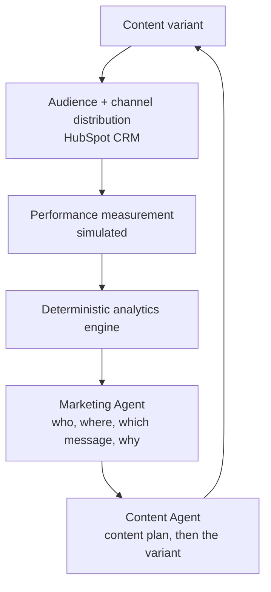

# SignalLoop

**An AI-powered content experimentation system for product marketers.** SignalLoop analyzes how audiences, channels and messaging are performing, uses a Marketing Agent to decide the next marketing move, and passes that strategy to a Content Agent that plans and writes the next content experiment.

### 👉 [View the case study](https://signalloop-shiva.netlify.app)

A product marketing portfolio project by **Shiva Goel**. It shows how AI can structure a repeatable GTM workflow, from company context to persona-based messaging, CRM-style distribution, measurement, and next-step recommendations. It is designed as a PMM project, not just a code demo.

---

## Workflow at a Glance



The loop answers, in order: **who** responded, **where** they responded, **what** message worked, **why** it might matter, **what** to test next, and **what** content to create.

## Preview


---

## How It Works

SignalLoop starts from a company profile: its audiences, channels, messaging angles, content types and brand rules. A baseline campaign runs every audience on its channels; deterministic code then calculates what happened (CTR, pooled history, efficiency and volume leaders, and whether differences are too small to call).

Two AI agents with separate jobs take it from there. The **Marketing Agent** decides who to prioritize, on which channel, with which messaging angle and content type, and states the hypothesis, weighing efficiency against volume for the campaign objective and citing the metrics it used. The **Content Agent** turns that decision into a content plan and then the content variant. The next experiment runs that variant against a control, and the results change what the agents recommend next.

The same engine adapts to different markets by swapping the profile: Ramp segments by organizational role, Square by business stage. See [Live Demo](#live-demo-the-experiment-loop) for the architecture and what is real, simulated or AI.

---

## Why I Built This

I built this to demonstrate how I think about AI-native product marketing: not just using AI to generate copy, but designing a repeatable system that connects segmentation, messaging, content creation, distribution, measurement, and optimization.

The goal is to show PMM judgment, GTM thinking, and AI workflow design in one practical project.

---

## What This Demonstrates

- Audience intelligence: how each segment responds, and how confident we can be
- Channel intelligence: efficiency versus volume, weighed against the campaign objective
- Messaging strategy: which angles and content types work for which audience
- Content planning: strategy before copy, grounded in what has been tested
- Experimentation: test versus control, with results that change the next decision
- AI system design with clear boundaries: code calculates, agents decide and create, and every recommendation is traceable to data
- CRM execution in HubSpot

---

## Repository Structure

```text
signalloop/
├── ai-content-pipeline/      # The runnable SignalLoop engine (CLI, dashboard, Claude Skill)
├── assets/                   # Screenshots and diagrams
├── docs/                     # Case study page (deployed to Netlify)
├── netlify/                  # Live demo: API function, analytics engine, simulator, Marketing and Content Agents, tests
├── netlify.toml              # Netlify build and functions settings
├── package.json              # Live demo dependencies and scripts
└── setup-content-engine.sh   # Setup helper
```

---

## Run Locally

Requires Python 3.10+. Runs with no API keys (mock mode).

```bash
cd ai-content-pipeline
python -m venv .venv && source .venv/bin/activate
pip install -r requirements.txt
python main.py run --profile examples/ramp.json
```

You can also run another company profile:

```bash
python main.py run --profile examples/square.json
python main.py run --profile examples/datadog.json
```

---

## Dashboard

```bash
cd ai-content-pipeline
python dashboard/app.py
```

Then open:

```text
http://127.0.0.1:5000
```

---

## Live Demo: the experiment loop

The [case study](https://signalloop-shiva.netlify.app/#live) includes an interactive experiment loop that runs on Netlify (`netlify/functions/api.mjs`):

```text
Campaign / content variant
        ↓
Audience + channel distribution      HubSpot CRM (live) + simulated delivery
        ↓
Performance measurement              simulated reach and clicks
        ↓
Deterministic analytics engine       code: CTR, pooled CTR, leaders, significance, insights
        ↓
Marketing Agent                      AI: who, where, which angle and content type, and why
        ↓
Content Agent                        AI: content plan, then the generated variant
        ↓
Next experiment (test vs control)    ↺
```

**Deterministic analytics** (`netlify/lib/analytics.mjs`) calculate reach, clicks, CTR, pooled historical CTR, performance by audience, channel, messaging angle and content type, change versus the previous experiment, the efficiency leader (highest CTR) and volume leader (most clicks), and whether a difference is too small to call (two-proportion z-test plus a minimum click count). Every metric has an id.

**Marketing Agent** (`netlify/lib/agents/marketing.mjs`) reads those metrics through read-only tools (`getAudiencePerformance`, `getChannelPerformance`, `getMessagingPerformance`, `getContentPerformance`, `getExperimentHistory`, `getCampaignObjective`, `getAvailableChannels`, `getAvailableMessagingAngles`) and decides the priority audience, channel, messaging angle, content type, hypothesis, trade-off and confidence. It must cite metric ids it actually retrieved; code rejects anything else.

**Content Agent** (`netlify/lib/agents/content.mjs`) takes that decision and, using `getAudienceProfile`, `getPreviousContent`, `getMessagingHistory`, `getTopPerformingContent`, `getBrandContext` and `getContentConstraints`, produces a content plan (insight, angle, topic, hook, headline, key message, CTA, format, brief) and then the content variant. It cannot change the Marketing Agent's choices and cannot repeat earlier topics.

**Run N shapes run N+1:** each planned experiment runs the agents' variant against a control (the best existing variant) for the same audience and channel. The simulator's click probability depends on audience, channel, messaging angle and content type, so better decisions produce better measured results, which change the analytics the agents read next.

**Campaign objective** (awareness, traffic, engagement, product consideration, conversion) changes how the Marketing Agent weighs efficiency against volume.

### What is real, simulated or AI

| Component | Status |
|---|---|
| HubSpot CRM (contacts, `persona` property, audience lists) | **Live** when `HUBSPOT_MODE=live` and `HUBSPOT_ACCESS_TOKEN` are set; mock otherwise |
| Campaign delivery | **Simulated** (no emails or posts are sent) |
| Performance data (reach, clicks) | **Simulated** (`netlify/lib/sim-truth.mjs`, hidden from the agents) |
| Analytics | **Deterministic code** |
| Marketing recommendation, content plan, content | **AI** (Groq, Gemini fallback) |
| Experiment history | **Stored** per visitor session in Netlify Blobs |

### Configuration (Netlify environment variables)

| Variable | Purpose |
|---|---|
| `GROQ_API_KEY` | Primary AI provider |
| `GEMINI_API_KEY` | Fallback AI provider when Groq fails or is rate limited |
| `GROQ_MODEL`, `GEMINI_MODEL` | Optional model overrides (defaults `openai/gpt-oss-120b`, `gemini-2.5-flash`) |
| `HUBSPOT_ACCESS_TOKEN`, `HUBSPOT_MODE=live` | Live HubSpot writes |

The HubSpot key needs these scopes: `crm.objects.contacts.read`, `crm.objects.contacts.write`, `crm.lists.read`, `crm.lists.write`, `crm.schemas.contacts.read`, `crm.schemas.contacts.write`.

Without an AI key the demo still runs baselines and analytics, and clearly reports that the agents are not connected.

### Run locally (Node 20+)

```bash
npm install
npm run dev
```

Then open `http://localhost:8888/#live`. Run the tests with `npm test`.

---

## Detailed Documentation

For the full technical workflow, see:

```text
ai-content-pipeline/README.md
```

For the Claude Skill version, see:

```text
ai-content-pipeline/SKILL.md
```

---

## Future Workflow Ideas

- Competitive positioning analyzer
- ICP research generator
- Sales enablement brief builder
- Customer interview synthesis workflow
- Launch messaging and GTM planning assistant

---

## License

© 2026 Shiva Goel. All rights reserved. This repository is shared for portfolio review only; no part of it may be copied, modified, or reused without written permission. See [LICENSE](LICENSE).
