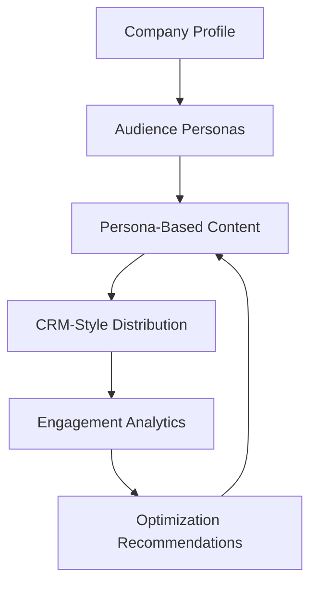

# SignalLoop

**A content system that learns from every send.** Human judgment decides the segmentation; the system runs the loop: write, send, measure, improve.

### 👉 [View the case study](https://signalloop-shiva.netlify.app)

A product marketing portfolio project by **Shiva Goel**. It shows how AI can structure a repeatable GTM workflow, from company context to persona-based messaging, CRM-style distribution, measurement, and next-step recommendations. It is designed as a PMM project, not just a code demo.

---

## Workflow at a Glance



## Preview


---

## How It Works

SignalLoop takes a company profile as input and turns it into segmented marketing content and performance recommendations. It moves from company profile to personas, content, CRM-style distribution, analytics, and optimization recommendations, and each run's results feed the next one.

The same engine adapts to different markets by swapping the profile: Zip segments by organizational role, Shopify by business stage, Datadog by technical and business function.

---

## Why I Built This

I built this to demonstrate how I think about AI-native product marketing: not just using AI to generate copy, but designing a repeatable system that connects segmentation, messaging, content creation, distribution, measurement, and optimization.

The goal is to show PMM judgment, GTM thinking, and AI workflow design in one practical project.

---

## What This Demonstrates

- Audience segmentation
- Messaging and positioning
- Content strategy
- CRM-style campaign execution
- Performance analysis
- AI workflow design
- GTM system thinking
- Turning repeatable marketing processes into scalable systems

---

## Repository Structure

```text
signalloop/
├── ai-content-pipeline/      # The runnable SignalLoop engine (CLI, dashboard, Claude Skill)
├── assets/                   # Screenshots and diagrams
├── docs/                     # Case study page (deployed to Netlify)
└── setup-content-engine.sh   # Setup helper
```

---

## Run Locally

Requires Python 3.10+. Runs with no API keys (mock mode).

```bash
cd ai-content-pipeline
python -m venv .venv && source .venv/bin/activate
pip install -r requirements.txt
python main.py run --profile examples/zip.json
```

You can also run another company profile:

```bash
python main.py run --profile examples/shopify.json
python main.py run --profile examples/datadog.json
```

---

## Dashboard

```bash
cd ai-content-pipeline
python dashboard/app.py
```

Then open:

```text
http://127.0.0.1:5000
```

---

## Detailed Documentation

For the full technical workflow, see:

```text
ai-content-pipeline/README.md
```

For the Claude Skill version, see:

```text
ai-content-pipeline/SKILL.md
```

---

## Future Workflow Ideas

- Competitive positioning analyzer
- ICP research generator
- Sales enablement brief builder
- Customer interview synthesis workflow
- Launch messaging and GTM planning assistant

---

## License

© 2026 Shiva Goel. All rights reserved. This repository is shared for portfolio review only; no part of it may be copied, modified, or reused without written permission. See [LICENSE](LICENSE).
