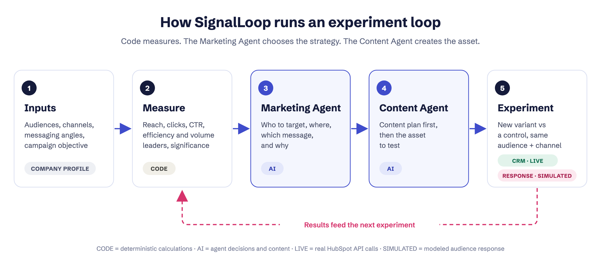
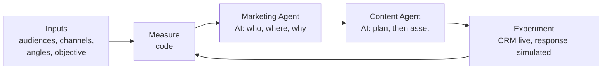

# SignalLoop

**An AI-assisted marketing experimentation system for product marketers.** Deterministic code measures how audiences, channels and messages perform; a **Marketing Agent** chooses the next marketing strategy; a **Content Agent** turns that strategy into an executable content plan and asset. Every experiment runs against a control, and its results shape the next decision.

### 👉 [View the case study and live demo](https://signalloop-shiva.netlify.app)

A product marketing portfolio project by **Shiva Goel**.



---

## The problem

Content teams publish constantly but still pick the next piece on instinct. Results sit in separate tools, small differences get mistaken for wins, and nothing records what was already tested.

AI writing tools don't fix this. They make more content cheaper, but they don't know which audience is responding, which channel reaches them, or which message already failed. The valuable step comes before the writing: **deciding which audience, channel and message to test next, and why.** SignalLoop asks AI to make that call from measured evidence.

## How it works



1. **Inputs.** Each company profile defines audiences, their channels, messaging angles, content types, brand rules and constraints. The marketer sets the campaign objective (awareness, traffic, engagement, product consideration, or conversion).
2. **Measure (code).** The analytics engine calculates reach, clicks, CTR, pooled history by audience, channel, angle and content type, the change since the previous experiment, the efficiency leader (highest CTR) and volume leader (most clicks), and whether a difference is too small to call (two-proportion z-test plus a minimum click count). Every metric has an id.
3. **Marketing Agent (AI).** Reads only the metrics it needs through read-only tools and decides the priority audience, channel, messaging angle, content type and hypothesis, weighing efficiency against volume for the objective. It must cite metric ids it actually retrieved; code rejects anything else.
4. **Content Agent (AI).** Turns that decision into a content plan (insight, angle, topic, hook, headline, key message, CTA, format, brief) and then the asset. It can't change the Marketing Agent's choices and can't repeat earlier topics.
5. **Experiment.** The new variant runs against a control (the best variant so far for that audience and channel). HubSpot contacts and lists are updated for real; audience response is simulated. Results return to step 2.

## Why analytics are calculated in code

Language models are unreliable at arithmetic, can't be audited, and can "find" patterns that aren't in the data. Keeping all math in deterministic code means every number is reproducible, and every agent recommendation can be traced to the exact metrics it cited.

## What is real, simulated or AI

| Component | Status |
|---|---|
| HubSpot CRM (fictional sample contacts, `persona` property, audience lists) | **LIVE** when `HUBSPOT_MODE=live` and `HUBSPOT_ACCESS_TOKEN` are set; mock otherwise |
| Campaign delivery | **SIMULATED**: no emails or posts are sent |
| Performance data (reach, clicks) | **SIMULATED** by `netlify/lib/sim-truth.mjs`, which the agents never see |
| Analytics | **CODE**: deterministic |
| Marketing recommendation, content plan and asset | **AI** (Groq, with Gemini as fallback) |
| Experiment history | **STORED** per visitor session in Netlify Blobs |

No performance number in this project comes from a real campaign.

## What this demonstrates

- **Audience intelligence:** how each segment responds, and how confident we can be
- **Channel intelligence:** efficiency versus volume, weighed against the campaign objective
- **Messaging strategy:** which angles and content types work for which audience
- **Content planning:** strategy before copy, grounded in what has been tested
- **Experimentation:** test versus control, with results that change the next decision
- **AI system design with clear boundaries:** code calculates, agents decide and create, and recommendations are traceable

## What production would need

- **Real performance data:** email engagement from HubSpot Marketing Hub, social data, and site analytics, with attribution to pipeline
- **Real delivery with human approval:** review for brand, legal and product claims
- **Stronger experiment design:** sample sizes and durations set in advance, and more than two variants per test
- **Agent quality and oversight:** an evaluation set, logging of every tool call and output, and stricter claim checks
- **Scale and governance:** paid model tiers, cost budgets, consent and privacy controls for real contacts
- **Business outcomes:** optimize for pipeline and revenue, not only clicks

---

## Repository structure

```text
signalloop/
├── docs/index.html            # Case study and live demo page (published by Netlify)
├── netlify/
│   ├── functions/api.mjs      # API: /api/session, /api/run, /api/plan, /api/reset
│   ├── lib/
│   │   ├── analytics.mjs      # Deterministic analytics engine
│   │   ├── simulator.mjs      # Simulated audience response
│   │   ├── sim-truth.mjs      # Hidden simulation model (never shown to agents)
│   │   ├── loop.mjs           # Experiment loop: distribute, measure, plan
│   │   ├── hubspot.mjs        # HubSpot CRM client (live or mock)
│   │   ├── llm.mjs            # Groq and Gemini adapter with fallback
│   │   ├── store.mjs          # Netlify Blobs storage
│   │   └── agents/            # Marketing Agent, Content Agent, their tools and validation
│   ├── test/                  # node:test suite
│   └── dev-server.mjs         # Local preview server
├── data/
│   ├── companies/             # Ramp and Square profiles, plus _template.json
│   └── contacts.json          # 20 fictional sample contacts (@example.com)
├── assets/preview-flow.png    # Architecture diagram
├── netlify.toml
└── package.json
```

## Configuration (Netlify environment variables)

| Variable | Purpose |
|---|---|
| `GROQ_API_KEY` | Primary AI provider (secret) |
| `GEMINI_API_KEY` | Fallback AI provider when Groq fails or is rate limited (secret) |
| `GROQ_MODEL`, `GEMINI_MODEL` | Optional model overrides (defaults `openai/gpt-oss-120b`, `gemini-2.5-flash`) |
| `HUBSPOT_ACCESS_TOKEN` | HubSpot service key (secret) with scopes `crm.objects.contacts.read`, `crm.objects.contacts.write`, `crm.lists.read`, `crm.lists.write`, `crm.schemas.contacts.read`, `crm.schemas.contacts.write` |
| `HUBSPOT_MODE` | `live` to write to HubSpot; anything else uses mock mode |

Without an AI key, the demo still runs baselines and analytics, and clearly reports that the agents are not connected.

## Run locally (Node 22.9+)

1. Install dependencies and create your local environment file. `.env` is ignored by git; never commit it.

   ```bash
   npm install
   cp .env.example .env
   ```

2. Open `.env` and add `GROQ_API_KEY` and/or `GEMINI_API_KEY`. Keep `HUBSPOT_MODE=mock` locally unless you want test runs to write to HubSpot.

3. Check that the providers support what the agents need (a reply, tool calling and JSON-schema output):

   ```bash
   npm run check:ai
   ```

4. Run one real loop in the terminal (baseline, then Marketing Agent and Content Agent):

   ```bash
   npm run try:loop
   ```

   Optionally pass a company and objective, for example `npm run try:loop -- square traffic`.

5. Preview the site and live demo at `http://localhost:8888/#live`:

   ```bash
   npm run dev
   ```

Run the automated tests (no keys needed) with `npm test`.

---

## License

© 2026 Shiva Goel. All rights reserved. This repository is shared for portfolio review only; no part of it may be copied, modified, or reused without written permission. See [LICENSE](LICENSE).
