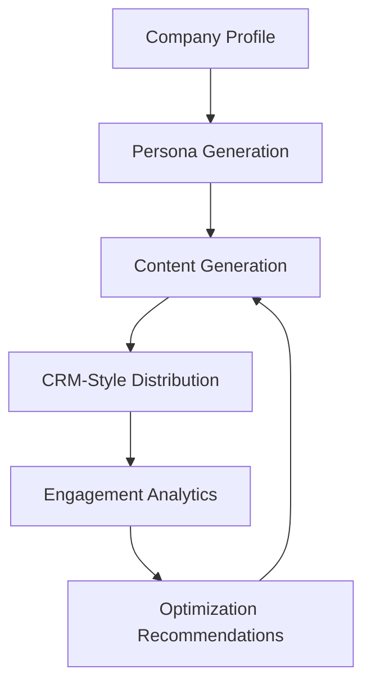

# SignalLoop: AI Content Pipeline

SignalLoop is a runnable AI-native product marketing workflow. See the [case study](https://signalloop-shiva.netlify.app) for the full walkthrough.

It takes a company profile as input, generates audience personas, creates persona-based content, simulates CRM-style campaign distribution, tracks engagement, and recommends the next content opportunities.

This project is designed as a PMM workflow prototype, not a full production marketing platform. It demonstrates how AI can help structure repeatable GTM work: segmentation, messaging, content creation, campaign execution, measurement, and optimization.

---

## Workflow Overview



---

## What the Workflow Does

1. Reads a company profile from JSON
2. Generates audience personas
3. Creates blog and newsletter content
4. Simulates CRM-style distribution
5. Tracks campaign engagement
6. Stores performance history
7. Recommends next topics, angles, and headline tests

---

## Two Ways to Use This

### 1. As a runnable program

Run the workflow locally with a sample company profile:

```bash
python main.py run --profile examples/ramp.json
```

You can also run other company profiles:

```bash
python main.py run --profile examples/square.json
python main.py run --profile examples/datadog.json
```

### 2. As a Claude Skill

The same workflow logic can also be used as a Claude Skill. See:

```text
SKILL.md
```

The skill version lets Claude take a company or ICP, propose personas, and generate content and recommendations.

---

## Repository Structure

```text
ai-content-pipeline/
├── README.md
├── SKILL.md
├── main.py
├── config.py
├── requirements.txt
├── .env.example
├── smoke_test.py
├── examples/
├── pipeline/
├── data/
└── dashboard/
```

---

## Core Modules

```text
pipeline/
├── llm.py                  # LLM wrapper and mock/live mode
├── personas.py             # Audience persona generation
├── content_generation.py   # Blog and newsletter generation
├── crm.py                  # CRM-style contacts and segments
├── distribution.py         # Campaign distribution simulation
├── analytics.py            # Engagement metrics
├── optimization.py         # Next-step recommendations
├── report.py               # Output summaries
└── storage.py              # Local storage and history
```

---

## Company Profiles and Segmentation

The workflow is company-profile driven. The same engine can run for different companies by swapping the input profile.

Example company profiles include:

| Company | Market                 | Segmentation logic              | Example audiences                                           |
| ------- | ---------------------- | ------------------------------- | ----------------------------------------------------------- |
| Ramp    | Finance automation     | Organizational role             | Finance Leader, Controller, Employee Spender                |
| Square  | SMB commerce           | Business stage                  | New Seller, Growing Business, Multi-Location Operator       |
| Datadog | Cloud observability    | Technical and business function | Engineering Leader, DevOps Team, Platform Buyer             |

The segmentation logic adapts to the market instead of only changing persona names.

---

## Run Locally

Requires Python 3.10+.

```bash
cd ai-content-pipeline

python -m venv .venv
source .venv/bin/activate

pip install -r requirements.txt
```

Run the pipeline:

```bash
python main.py run --profile examples/ramp.json
```

Run another company profile:

```bash
python main.py run --profile examples/square.json
python main.py run --profile examples/datadog.json
```

Inspect campaign history:

```bash
python main.py history
```

Generate optimization recommendations from history:

```bash
python main.py optimize
```

---

## Dashboard

Start the dashboard:

```bash
python dashboard/app.py
```

Then open:

```text
http://127.0.0.1:5000
```

The dashboard provides a simple control room for reviewing generated content, segment performance, campaign summaries, and optimization recommendations.

---

## Mock vs. Live Mode

The workflow runs with zero API keys by default.

External dependencies are mocked cleanly so a reviewer can clone and run the project without setting up Anthropic or HubSpot credentials.

| Mode          | What happens                                                               |
| ------------- | -------------------------------------------------------------------------- |
| Mock mode     | Uses deterministic content, mock CRM actions, and simulated engagement     |
| Live LLM mode | Uses Anthropic Claude if `ANTHROPIC_API_KEY` is provided                   |
| Live CRM mode | Sends real HubSpot requests if `HUBSPOT_MODE=live` and a token is provided |

Use `.env.example` as the setup reference.

---

## Tools and Technologies

| Area            | Tool                             |
| --------------- | -------------------------------- |
| Language        | Python                           |
| LLM integration | Anthropic Claude / mock fallback |
| CRM simulation  | HubSpot-style CRM flow           |
| Storage         | SQLite                           |
| Dashboard       | Flask + Jinja2                   |
| Output format   | JSON + Markdown                  |

---

## HubSpot-Style CRM Flow

The CRM stage simulates realistic marketing operations:

| Action               | Example behavior                                    |
| -------------------- | --------------------------------------------------- |
| Contact upsert       | Creates or updates contacts with persona properties |
| Persona segmentation | Groups contacts into persona-based lists            |
| Newsletter send      | Sends a persona-specific content variant            |
| Campaign logging     | Records campaign activity and engagement data       |

In mock mode, the workflow builds the request structure and logs it locally instead of sending it to a live CRM.

---

## Outputs

The workflow can generate:

* Audience personas
* Blog content
* Persona-specific newsletter variants
* Campaign performance metrics
* AI-style performance summaries
* Optimization recommendations
* Local history of generated outputs

---

## Design Notes

* **PMM-first workflow:** The system is designed around product marketing tasks, not just content generation.
* **Same logic, multiple front ends:** CLI and dashboard share the same pipeline modules.
* **Mock-first design:** The project can run without API keys, which makes it easy to demo.
* **History-aware optimization:** Campaign metrics persist locally so the system can recommend next topics and headline tests.
* **Modular architecture:** Each PMM workflow step lives in its own module.

---

## If I Had More Time

* Add real A/B testing workflow support
* Add competitive positioning output
* Add sales enablement brief generation
* Add customer interview synthesis
* Pull real engagement data from HubSpot analytics
* Add a scheduler for weekly content and campaign recommendations
